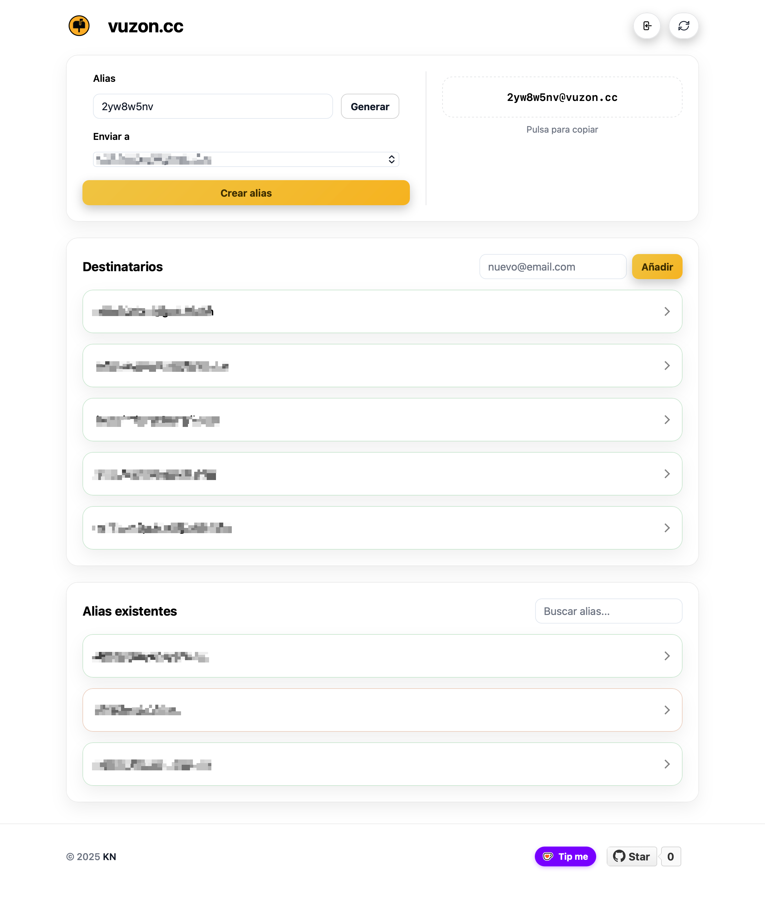

<p align="center">
  
</p>

<div align="center">

[English](#english) | [Español](#spanish)

</div>

<p align="center">
  <a href="https://github.com/Kernel-Nomad/vuzon/stargazers">
    
  </a>
  &nbsp;
  <a href="https://github.com/Kernel-Nomad/vuzon/issues">
    
  </a>
  &nbsp;
  <a href="./LICENSE">
    
  </a>
  &nbsp;
  
</p>

<p align="center">
  
  &nbsp;
  
  &nbsp;
  
  &nbsp;
  
  &nbsp;
  
</p>

<p align="center">
  
</p>

<a id="english"></a>

# vuzon

Lightweight UI that uses the **Cloudflare Email Routing API** to create and manage **aliases** and **destination addresses**.

> What is Email Routing: https://developers.cloudflare.com/email-routing/

---

## Features

- Create **aliases/rules** that route emails to **verified destination addresses**.
- List and manage **destination addresses** (add/remove).
- **Enable/Disable** rules directly from the UI.
- Session-protected dashboard with login/logout endpoints.
- Automatic detection of `CF_ZONE_ID` and `CF_ACCOUNT_ID` from `DOMAIN` when they are not provided.

---

## Requirements

- A Cloudflare domain with **Email Routing** available.
- A Cloudflare **API Token** with minimal permissions (see **Security**).
- Docker (for deployment with Compose) or Node.js >= 18 (for local execution).

---

## Environment Variables

Create a `.env` file in the project root:

**Suggested minimal token scopes:**
- **Account -> Email Routing Addresses: Read & Edit**
- **Zone -> Email Routing Rules: Read & Edit**

```env
# Token with edit permissions for Email Routing in your zone and account
CF_API_TOKEN=your_cloudflare_api_token
DOMAIN=yourdomain.com

# Optional: if set, startup skips automatic detection
CF_ZONE_ID=your_cloudflare_zone_id
CF_ACCOUNT_ID=your_cloudflare_account_id

# Credentials to access the vuzon panel
AUTH_USER=admin
AUTH_PASS=your_secure_password

# Public URL (optional, just for reference)
BASE_URL=https://vuzon.yourdomain.com

# Port where the service will be exposed
VUZON_PORT=8001

# Session secret (optional; if omitted, .session_secret is generated locally)
SESSION_SECRET=your_secure_secret
```

---

## Deployment with Docker Compose

> Tip: the repository includes a `.dockerignore` file that excludes dependencies, logs, and environment files, reducing the build context for lighter images and faster builds.

```yaml
services:
  vuzon:
    container_name: vuzon
    image: ghcr.io/kernel-nomad/vuzon
    env_file:
      - .env
    restart: unless-stopped
    ports:
      - "${VUZON_PORT:-8001}:8001"
    volumes:
      - ./sessions:/app/sessions
```

**Run:**

```bash
docker compose up -d
# Open http://localhost:8001
```

---

## Local Execution without Docker

```bash
npm install
npm start
# App at http://localhost:8001
```

`npm start` follows a build-first flow: it runs `npm run build`, which vendors Alpine into `public/vendor/alpine.js`, generates `dist/public`, and then boots `node src/server.js`.

> Requires Node.js >= 18.

---

## Validation

```bash
npm run check
```

- `npm run check` executes the build, syntax checks, and the full test suite.
- Container validation stays aligned with the same layout assumptions via `docker build -t vuzon-local .`.
- Integration tests under `tests/integration/server/` open a temporary local server. In restricted sandboxes you may see `listen EPERM` even when the assertions are correct.

---

## Repository Layout

- `src/server/`: backend source split into `bootstrap/`, `features/`, `platform/`, and `config/`.
- `src/client/`: frontend source split into `entrypoints/`, `app/`, `features/`, `shared/`, and `compat/public-utils/`.
- `src/client/compat/public-utils/`: source of the public compatibility layer emitted as `/utils/*.js`.
- Internal client modules should depend on `src/client/shared/`; `src/client/compat/public-utils/` exists only to preserve the public `/utils/*.js` surface.
- `public/`: static source files (`pages/`, `styles/`, `assets/`, `vendor/`, `site.webmanifest`) used as build input, not served directly.
- `public/vendor/alpine.js`: vendored asset produced by `npm run setup`; it is copied to `/js/alpine.js` during the build and is not versioned.
- `dist/public/`: generated frontend artifacts and the only directory served by Express at runtime.
- `src/shared/`: reserved for truly shared modules; it intentionally stays empty except for a placeholder `.gitkeep` until a real cross-layer use case exists.
- `tests/unit/`, `tests/integration/`, `tests/architecture/`, `tests/scripts/`: official test taxonomy.
- `docs/architecture/repository-structure.md`: overview of the canonical repository organization.

---

## Build and Runtime Flow

1. `scripts/download-alpine.js` vendors Alpine into `public/vendor/alpine.js`.
2. `scripts/build-client.js` bundles `src/client/entrypoints/*`, emits `/utils/*.js` from `src/client/compat/public-utils/*`, and copies static sources into `dist/public`.
3. Express serves only `dist/public`, while backend routes stay in `src/server/features/*`.

Canonical source-to-output mapping:

- `src/client/entrypoints/dashboard.js` -> `/app.js`
- `src/client/entrypoints/login.js` -> `/js/login.js`
- `src/client/compat/public-utils/*.js` -> `/utils/*.js`
- `public/pages/*.html` -> `/index.html` and `/login.html`
- `public/styles/ui.css` -> `/ui.css`
- `public/vendor/alpine.js` -> `/js/alpine.js`
- `public/assets/*` -> `/assets/*`
- `public/site.webmanifest` -> `/site.webmanifest`

The generated public surface is:

- `app.js`
- `js/login.js`
- `utils/destSelection.js`
- `utils/error.js`
- `utils/verification.js`
- `index.html`
- `login.html`
- `ui.css`
- `js/alpine.js`
- `assets/`
- `site.webmanifest`

---

## Backend Routes

The backend exposes login/session endpoints plus a REST proxy to Cloudflare. Cloudflare-facing routes and `GET /api/me` require an authenticated session.

- `GET  /healthz` - Public healthcheck that returns `{ ok: true }`.
- `POST /api/login` - Authenticates with `{ username, password }`.
- `POST /api/logout` - Closes the current session.
- `GET  /api/me` - Returns `{ email, rootDomain }` for the authenticated user.
- `GET  /api/addresses` - Lists destination addresses.
- `POST /api/addresses` - Creates destination address `{ email }`.
- `DELETE /api/addresses/:id` - Deletes destination address.
- `GET  /api/rules` - Lists rules/aliases.
- `POST /api/rules` - Creates rule `{ localPart, destEmail }` where `localPart` must already be lowercase and match `^[a-z0-9._-]+$` (1-64 chars), and `destEmail` must be a valid email.
- `DELETE /api/rules/:id` - Deletes rule.
- `POST /api/rules/:id/enable` - Enables rule.
- `POST /api/rules/:id/disable` - Disables rule.

Unauthenticated requests to `/api/*` return `401 { error: "No autorizado" }` and do not redirect to the login page.

> API References (Cloudflare): rules and addresses in the official documentation.

---

## Basic Usage

1. **Enable Email Routing** in your zone (from the Cloudflare UI or dashboard).
2. Add a **destination address** (a verification email will be sent).
3. Sign in to the vuzon panel and create an **alias (rule)** using a lowercase local-part and a **verified destination**.

---

## Security

- Use **API Tokens** with **minimal privileges** instead of the Global API Key.
- Place the app behind a reverse proxy with **TLS** and, if applicable, add **authentication**.

---

<a id="spanish"></a>

# vuzon

UI ligera que usa la **API de Cloudflare Email Routing** para crear y gestionar **alias** y **destinatarios** de forma sencilla.

> Que es Email Routing: https://developers.cloudflare.com/email-routing/

---

## Caracteristicas

- Crear **alias/reglas** que enrutan correos a **destinatarios verificados**.
- Listado y gestion de **destinatarios** (anadir/eliminar).
- **Habilitar/Deshabilitar** reglas desde la UI.
- Panel protegido por sesion con endpoints de login/logout.
- Deteccion automatica de `CF_ZONE_ID` y `CF_ACCOUNT_ID` a partir de `DOMAIN` cuando no se proporcionan.

---

## Requisitos

- Un dominio en Cloudflare con **Email Routing** disponible.
- Un **API Token** de Cloudflare con permisos minimos (ver **Seguridad**).
- Docker (para despliegue con Compose) o Node.js >= 18 (para ejecucion local).

---

## Variables de entorno

Crea un `.env` en la raiz del proyecto:

**Scopes minimos sugeridos para el token:**

- **Account -> Email Routing Addresses: Read & Edit**
- **Zone -> Email Routing Rules: Read & Edit**

```env
# Token con permisos de edicion para Email Routing en tu zona y cuenta
CF_API_TOKEN=tu_token_api_de_cloudflare
DOMAIN=tudominio.com

# Opcional: si se definen, el arranque no intenta autodetectarlos
CF_ZONE_ID=tu_zone_id_de_cloudflare
CF_ACCOUNT_ID=tu_account_id_de_cloudflare

# Credenciales para acceder al panel de vuzon
AUTH_USER=admin
AUTH_PASS=tu_contraseña_segura

# URL publica (opcional, para referencia)
BASE_URL=https://vuzon.tudominio.com

# Puerto donde se expondrá el servicio
VUZON_PORT=8001

# Secreto de sesion (opcional; si falta, se genera .session_secret localmente)
SESSION_SECRET=tu_secreto_seguro
```

---

## Despliegue con Docker Compose

> Consejo: el repositorio incluye un `.dockerignore` que excluye dependencias, logs y archivos de entorno, reduciendo el contexto de build y logrando imagenes mas ligeras y compilaciones mas rapidas.

```yaml
services:
  vuzon:
    container_name: vuzon
    image: ghcr.io/kernel-nomad/vuzon
    env_file:
      - .env
    restart: unless-stopped
    ports:
      - "${VUZON_PORT:-8001}:8001"
    volumes:
      - ./sessions:/app/sessions
```

**Levantar:**

```bash
docker compose up -d
# Abre http://localhost:8001
```

---

## Ejecucion local sin Docker

```bash
npm install
npm start
# App en http://localhost:8001
```

`npm start` sigue un flujo build-first: ejecuta `npm run build`, que vendoriza Alpine en `public/vendor/alpine.js`, genera `dist/public` y despues arranca `node src/server.js`.

> Requiere Node.js >= 18.

---

## Validacion

```bash
npm run check
```

- `npm run check` ejecuta el build, el chequeo sintactico y la suite completa de tests.
- La validacion del contenedor se mantiene sobre el mismo layout con `docker build -t vuzon-local .`.
- Las pruebas de `tests/integration/server/` levantan un servidor temporal local. En sandboxes restringidos puede aparecer `listen EPERM` aunque las aserciones sean correctas.

---

## Estructura del repositorio

- `src/server/`: backend dividido en `bootstrap/`, `features/`, `platform/` y `config/`.
- `src/client/`: frontend dividido en `entrypoints/`, `app/`, `features/`, `shared/` y `compat/public-utils/`.
- `src/client/compat/public-utils/`: fuente de la capa publica de compatibilidad emitida como `/utils/*.js`.
- Los modulos internos del cliente deben depender de `src/client/shared/`; `src/client/compat/public-utils/` existe solo para preservar la superficie publica `/utils/*.js`.
- `public/`: fuentes estaticas (`pages/`, `styles/`, `assets/`, `vendor/`, `site.webmanifest`) usadas como input del build; no se sirven directamente.
- `public/vendor/alpine.js`: asset vendorizado por `npm run setup`; el build lo publica como `/js/alpine.js` y no se versiona.
- `dist/public/`: artefactos generados del frontend y unico directorio servido por Express en runtime.
- `src/shared/`: reservado para modulos realmente compartidos; permanece vacio salvo por un `.gitkeep` hasta que exista una necesidad real entre capas.
- `tests/unit/`, `tests/integration/`, `tests/architecture/`, `tests/scripts/`: taxonomia oficial de pruebas.
- `docs/architecture/repository-structure.md`: resumen de la organizacion canonica del repositorio.

---

## Flujo de build y runtime

1. `scripts/download-alpine.js` vendoriza Alpine en `public/vendor/alpine.js`.
2. `scripts/build-client.js` empaqueta `src/client/entrypoints/*`, emite `/utils/*.js` desde `src/client/compat/public-utils/*` y copia los estaticos a `dist/public`.
3. Express sirve exclusivamente `dist/public`, mientras las rutas backend viven en `src/server/features/*`.

Mapping canonico de fuentes a artefactos:

- `src/client/entrypoints/dashboard.js` -> `/app.js`
- `src/client/entrypoints/login.js` -> `/js/login.js`
- `src/client/compat/public-utils/*.js` -> `/utils/*.js`
- `public/pages/*.html` -> `/index.html` y `/login.html`
- `public/styles/ui.css` -> `/ui.css`
- `public/vendor/alpine.js` -> `/js/alpine.js`
- `public/assets/*` -> `/assets/*`
- `public/site.webmanifest` -> `/site.webmanifest`

La superficie publica generada es:

- `app.js`
- `js/login.js`
- `utils/destSelection.js`
- `utils/error.js`
- `utils/verification.js`
- `index.html`
- `login.html`
- `ui.css`
- `js/alpine.js`
- `assets/`
- `site.webmanifest`

---

## Rutas del backend

El backend expone endpoints de login/sesion y un proxy REST hacia Cloudflare. Las rutas que hablan con Cloudflare y `GET /api/me` requieren sesion autenticada.

- `GET  /healthz` - Healthcheck publico que devuelve `{ ok: true }`.
- `POST /api/login` - Autentica con `{ username, password }`.
- `POST /api/logout` - Cierra la sesion actual.
- `GET  /api/me` - Devuelve `{ email, rootDomain }` para el usuario autenticado.
- `GET  /api/addresses` - Lista destinatarios.
- `POST /api/addresses` - Crea destinatario `{ email }`.
- `DELETE /api/addresses/:id` - Elimina destinatario.
- `GET  /api/rules` - Lista reglas/alias.
- `POST /api/rules` - Crea regla `{ localPart, destEmail }` donde `localPart` debe venir ya en minusculas y cumplir `^[a-z0-9._-]+$` (1-64 caracteres), y `destEmail` debe ser un correo valido.
- `DELETE /api/rules/:id` - Elimina regla.
- `POST /api/rules/:id/enable` - Habilita regla.
- `POST /api/rules/:id/disable` - Deshabilita regla.

Las peticiones no autenticadas a `/api/*` devuelven `401 { error: "No autorizado" }` y no redirigen a la pagina de login.

> Referencias de API (Cloudflare): reglas y direcciones en la documentacion oficial.

---

## Uso basico

1. **Activa Email Routing** en tu zona (desde la UI o dashboard de Cloudflare).
2. Añade una **direccion de destino** (se enviara un correo de verificacion).
3. Inicia sesion en el panel de vuzon y crea un **alias (regla)** usando un local-part en minusculas y un **destino verificado**.

---

## Seguridad

- Usa **API Tokens** con **privilegios minimos** en lugar de la Global API Key.
- Ubica la app tras un reverse proxy con **TLS** y, si procede, añade **autenticacion**.
